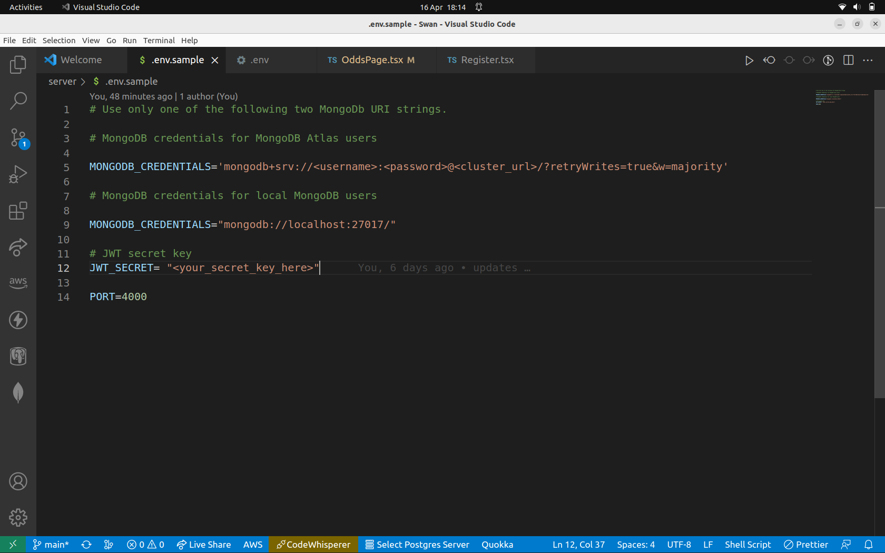

# Swan


Swan is an app designed to show you upcoming horseraces and check the odds of a given race. As it hasn't been deployed yet you can run it by following the steps in this README file.

## Prerequesites

1. In order to run Swan you will need to have access to an instance of MongoDB. You can either install MongoDB locally or create a free online account with MongoDB Atlas. 

[Installation](https://www.mongodb.com/docs/manual/installation/)
[Create a MongoDB account](https://www.mongodb.com/atlas/database)

## Screenshots


<table>
  <tr>
    <td></td>
    <td></td>
  </tr>
  <tr>
    <td></td>
    <td></td>
  </tr>
</table>


## Getting Started

1. Clone the repo

```
git clone git@github.com:MatthewKelsey/Swan.git

```


2. Install dependencies in both /client and /server folders

```
cd client
npm install
```
```
cd server
npm install
```

3. Create a .env file inside server folder and update MONGODB_CREDENTIALS, JWT_SECRET and PORT. Follow the .env.sample as a guide.
```
cd server
touch .env
```


4. If running mongoDB locally run MongoDB with the following command in a new terminal window. 

```
sudo mongod
```

5. Open a new terminal window and start the development server.
```
cd /server
npm start
```

6. Open another teminal window and start the front end app.
```
cd /client
npm start
```

## Assumptions
1. The project is limited to the chosen bookmaker and will require additional modifications to work with other bookmakers.
2. The bookmaker's website has a consistent structure for horse racing event pages.
3. The bookmaker's website does not have strict anti-bot measures that would prevent Puppeteer requests.
4. The /events endpoint will be used to fetch a collection of horse racing events, which will enable valid event URLs to be used directly from the bookmaker's website.
5. The bookmaker's website will consistently format data such as horse names and odds, making them easy to identify within the website's HTML structure.
6. To access the protected /odds endpoint, users must register and log in to obtain a JWT token.
7. To request odds via the /odds endpoint, API users must provide a valid event URL.
8. The authentication and authorization process will use JSON Web Tokens (JWT), which will be stored as a cookie in the browser to ensure a seamless login and logout experience for users.


## Tech Stack

* [React](https://reactjs.org) - Front end library for building user interfaces
* [Express JS](https://expressjs.com) - Web framework for Node.js
* [MongoDB with Mongoose](https://www.mongodb.com) - NoSQL database management system
* [Puppeteer](https://pptr.dev/) - A Node.js library which provides a high-level API to control Chrome/Chromium over the DevTools Protocol.
* [Jest](https://jestjs.io) - Testing suite for Node.js


## Developers

* Matthew Kelsey - [GitHub](https://github.com/MatthewKelsey) - [LinkedIn]()

