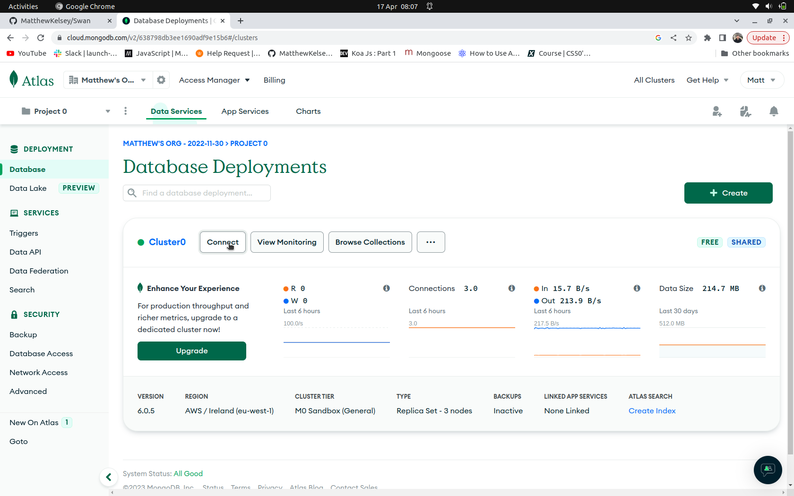
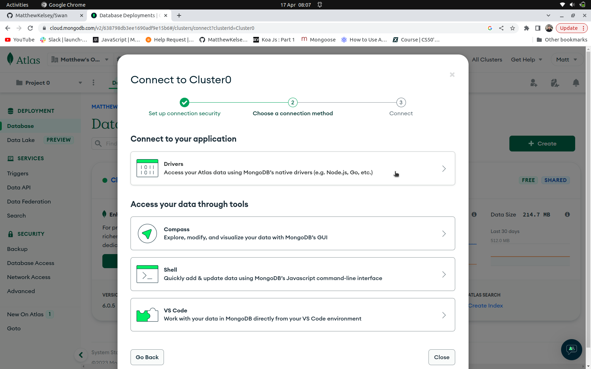
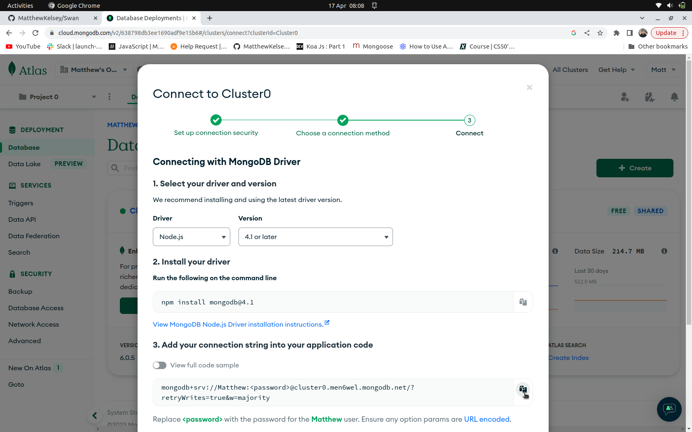
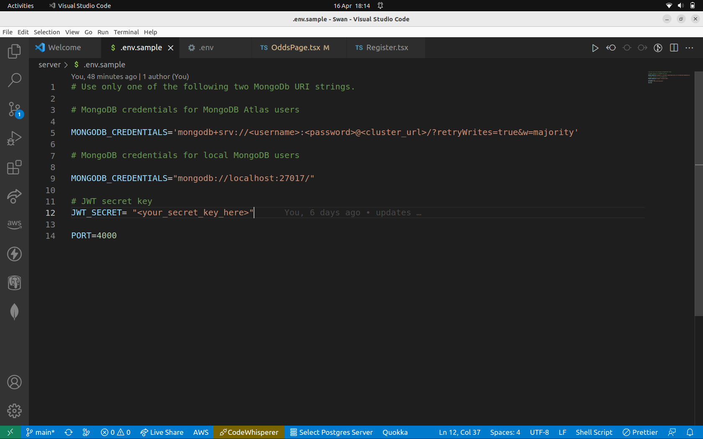

## Getting Started

Follow the appropriate instructions depending on whether you are using MongoDB Atlas or MongoDB Compass


## MongoDB Atlas Users

1. Create a free account by following the folloing link,

* [MongoDB Atlas](https://www.mongodb.com/atlas/database)

2. Once you have created your account click on the connect button.


3. Then click the drivers option. 


4. Copy the connection string. 


5. Create a .env file inside the server folder
 
```
touch .env
```

6. Paste the connection into your .env file as the MONGODB_CREDENTIALS variable. 



7. Change '<password>' to the the password you used for your MongoDB Atlas account. 
  
8. Save your changes and run the server with npm start from inside the server directory. 
  ```
  npm start
  ```


## MongoDB Compass Users (local)
  
 
  
1. Install MongoDB by following the manufacturer's instructions for your operating system. 
  
  * [Installation](https://www.mongodb.com/docs/manual/administration/install-community/)
  
2. Once installed MacOS and Linux users can run an instance of MongoDB by running the following command in a new terminal window.
  
  ```
  sudo mongod
  ```
  
3. Create a .env file inside the server folder.
 
```
touch .env
```
4. The default location for your local database is mongodb://localhost:27017/. Paste this connection string as your MONGODB_CREDENTIALS variable.
  
  

  
5. Save your changes and run the server with npm start from inside the server directory. 
  ```
  npm start
  ```


